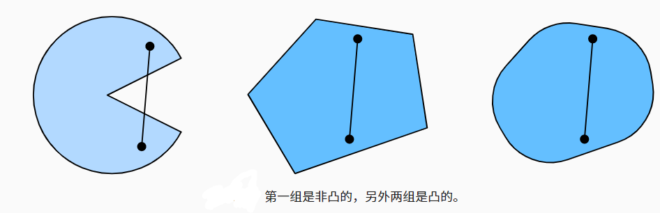
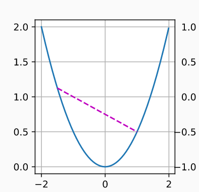
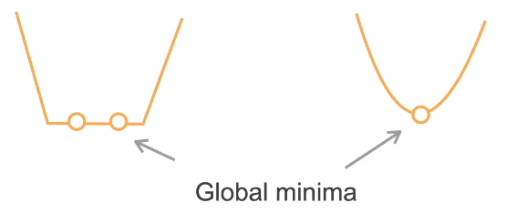

**使用迭代优化算法求解，一般只能保证找到局部最小值**

## 凸集

- 对于任何，a，b∈X，连接a和b的线段也位于X中，则向量空间中的一个集合X是*凸*的。

## 凸函数

- 给定一个凸集X，如果对于所有x,x′∈X和所有λ∈[0,1]，
- 函数f：C->R 是凸当且仅当 
  - $\lambda f(x) + (1-\lambda) f(x') \geq f(\lambda x + (1-\lambda) x').$
- 如果x≠x‘，λ∈(0,1)时不等式严格成立，那么就叫做严格凸函数
- 即两点连线，函数位于连线下方 

## 凸函数优化

- 如果代价函数f是凸的，且限制集合C是凸的，那么就是凸优化问题，那么局部最小一定是全局最小
- 严格凸优化问题有唯一的全居最小

## 凸和非凸的例子

- 凸：
  - 线性回归：$f(x)= ||Wx-b||^2_2$
  - softmax回归
- 非凸：其他
  - MLP、CNN、RNN、attention,...