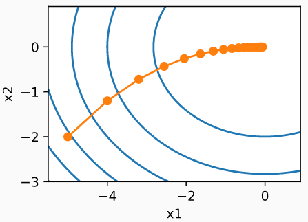
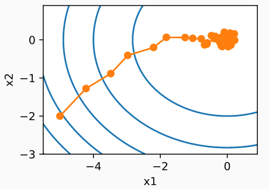

## 梯度下降

- 最简单地迭代求解算法
- 选取开始点$x_0$
- 对t = 1 ，... ，T
  - $x_t = x_{t-1}-\eta \triangledown f(x_{t-1})$
  - η叫做学习率

## 随机梯度下降

- 有n个样本时，计算$f(x) = \frac{1}{n}\sum_{i=0}^n\mathcal l_i(x)$的导数太贵
- 随机梯度下降在时间t随机选项样本$t_i$来近似f(x)
  - $x_t = x_{t-1}-\eta \triangledown f(x_{t-1})$
  - $\mathbb E[ \triangledown  l_{t_i}(x)] = \mathbb E[ \triangledown  f(x)]$
- 一次处理一个训练样本来取得进展。 
  - 二者各有利弊：每当数据非常相似时，梯度下降并不是非常“数据高效”。
  -  而由于CPU和GPU无法充分利用向量化，随机梯度下降并不特别“计算高效”

## 小批量随机梯度下降：最常用

- 计算单样本的梯度难完全利用硬件资源
- 小批量随机梯度下降在时间t采样一个随机子集$I \subset{1,...,n}$使得$|I_t| = b$
  - $\large x_t = x_{t-1}-\frac{\eta_t}{b}\sum_{i\in I_t}\limits  \triangledown \mathcal l_i(x_{t-1})$
- 同样，这是一个无偏的近似，但降低了方差
  - $\mathbb E[\frac{1}{b}\sum_{i\in I_t}\limits  \triangledown \mathcal l_i(x) = \triangledown  f(x)$
- 小批量随机梯度下降比随机梯度下降和梯度下降的速度快，收敛风险较小