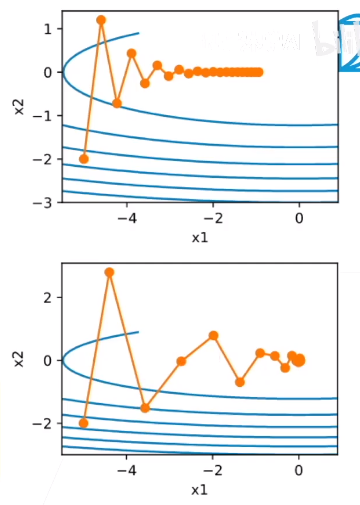

## 冲量法（momentum）：对梯度做平滑

- 使用平滑过的梯度对权重更新
  - $g_t = \frac{1}{b}\sum_{i\in I_t}\limits  \triangledown \mathcal l_i(x_{t-1})$$
  - $v_t = \beta v_{t-1} + g_t$，$w_t = w_{t-1} - \eta v_t$
- 梯度平滑：$v_t = g_t + \beta g_{t-1} + \beta^2g_{t-1} + \beta^3g_{t-3} + ...$
  - β常见取值[0.5, 0.9, 0.95, 0.99]

