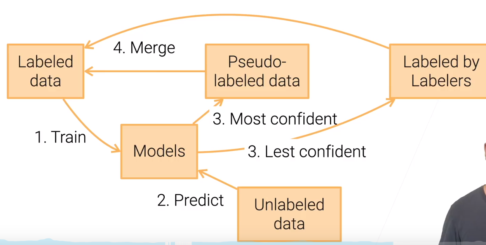

### 是否有足够多的标注

- 足够
  - 半监督学习
- 足够的预算
  - 找人给你标识，众包
- 都没有？
  - 弱监督学习 

### 半监督学习

- 解决的问题

  - 有一小部分数据有标注，有很多很多数据是没有标注（如何利用没有标注的数据）

- 对于是否有标注的数据做了以下假设：

  - 连续性：样本之间的特征是相似的话，则这两个样本很有可能是有相同的标注的
  - 类的聚类假设：数据是按类来分的；数据内在如有好一点的聚类的结构，一个类里面也可能有相同的标注
  - 流型(manifold)假设：收集的数据维度比较高，但是数据有可能是在低维的流型上分布的（可通过降维得到干净点的数据） 

- 自学习

  1. 先用标注好的数据训练一个模型
  2. 用训练好的模型对未标注的数据进行预测（得到伪标注数据）
  3. 将伪标注数据与已标好数据合并
  4. 在合并的数据的基础上再训练模型
  5. 不断进行上述过程

  注：

  - 伪标注数据可能噪音比较大，故将模型比较确信的伪标注数据保留下来。（怎么样选择置信样本）
  - 这里的模型是用来标记数据的，不用考虑该模型的成本，这个模型不会上线 

### 寻找众包（非专家）来标注存在的挑战

- 简单化用户知识：需要设计相对简单的任务，给他们清晰的指示，用起来比较简单（难度与可以做的人数呈反比）
- 成本：按小时来算，任务所花时间 * 任务数 * 标注工的时间成本 = 成本（预算够可以找专业公司）
- 质量控制：质量变化可能会比较大 
- 对于上面的问题有哪些技术来解决
  - 方便用户鉴别 设计经典样例，鉴别注解
  - 降低成本# 减少任务数据（主动学习）
    - 未标注数据由人来干预（对有意思的数据）
    - Uncertainty sampliing，选择特别不确信的样本，让人来做
    - Query-by-committee，用多个模型来投票预测哪个样本比较难
  - 主动学习与自学习混合使用
    - 
    - 确信的数据与原数据合并，不确信的发给标注工
- 质量控制（标错怎么办） 
  - 最简单的做法是，每个任务发给多个标注工，汇总之后，投票判断（贵）
  - 可以把难确信的数据发给多个人（多做几次）
  - 提前先出些题目，判断标注工靠不靠谱 

### 弱监督学习

- 半自动生成标号
- 数据编程
  - 带引导性的
  - 写相应的规则 

### 总结

- 获取标签的方法
  - 自训练：迭代训练模型以标记未标记的数据
  - 众包：利用标注工手动标记数据
  - 数据编程：分辨噪音标签的启发式编程
- 或者也可以使用无监督+自监督学习