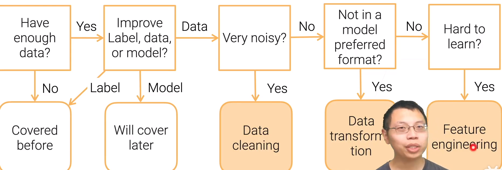

### 数据的错误

- 收集到的数据与真实观测值不一致【数值丢失，数值错误，极端的值】
- 好的模型对错误是有容忍度的
  - 给了错误的数据一样是能够收敛，但是精度会比用干净的数据低一点
- 部署了这样的模型后可能会影响新收集来的数据结果 

### 数据错误的类型

- 数据中某个样本的数值不在正常的分布区间中（Outlier）
- 违背了规则（Rule violations）
- 违反了语法上或语义上的限制（Pattern violations）

### 如何检测

- Outlier Detection：观察模型的分布、数值的分布
- Rule violations =》Rule-based Detection
  - Functional dependencies（功能性的依赖）：基于数据库的映射类型
  - Denial constraints（一阶逻辑表达式约束）：规则检测
- Pattern violations =》Pattern-based Detection
  - syntactic patterns：语法模式检测
  - Semantic patterns：语义模式检测

