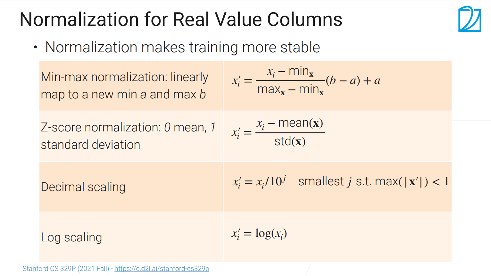

数据标注、清理到特征工程之间的操作是数据变换

### 对数值的变换 Normalization(普通化，正常化) 

- 把一个列里面的数值的最小值与最大值都限定到一个固定区间内，然后把所有的元素只通过线性变化出来
  - 将数据的单位放到合理的区间
- Z-score 一个常见的算法：通过算法使得均值变为0，方差变为1
- 把一列的数据变换成是-1到1之间的数据
- 对数值都是大于0，且数值变换比较大可以试一下log一下
  - log上面的加减等于原始数据的乘除，可以将计算基于百分比的

### 对图片的变换

- 将图片的尺寸变小
  - 机器学习对低分辨率的图片不在意
- 图片下采样
  - 当图片下采样的比较小，且jpeg选用中等质量压缩（80%-90%）时，可能会导致精度有1%的下降（ImageNet）
- 对图片进行降维
- **数据的大小与质量要做权衡**

### 对视频的变换

- 使用短视频(10s以内)，将视频切到感兴趣的部分
  - 也可以采样一些关键的图片帧出来，再解码，再随机选

### 对文本的变换

- 词根化(语法化)：把一个词变成常见的形式
  - am，are，is =》be
  - car，cars，car's，cars' =》car
- 词元化(机器学习算法中最小的单元)
  - word ：text.split(' ')
  - chat：text.split('')
  - subwords：
    - "a new gpu ! "=> "a","new","gp","##u","!"
    - 假设在gp是词典中一个认识的词，gpu不认识，##表示是词gpu的后面那一部分

