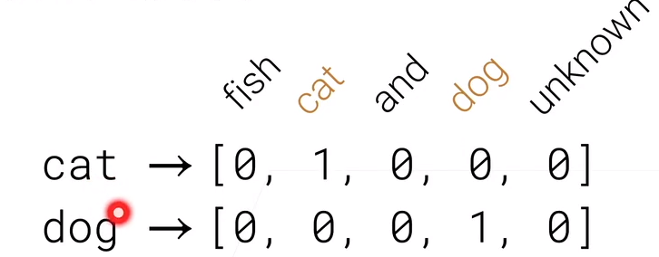
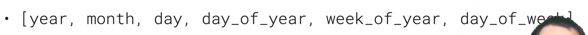
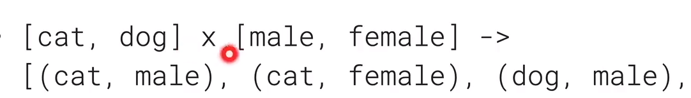
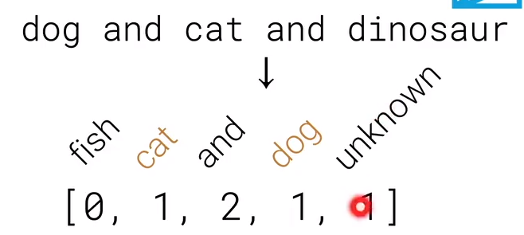

### 为什么需要特征工程

- 因为机器学习的算法比较喜欢定义的比较好的、它能比较好的去处理的、固定长度的输入输出 

### 对常见的数据做特征工程

- #### 对表的数据

  - **对于整型或浮点型的数据**
    - 可以直接用
    - 是把最大最小值拿出来，再把这个数据分成n个区间，如果值在区间中，则会给它对应区间的下标i
      - 这样可以让机器学习算法不去纠结一个具体的值（细粒度的值）
  - **对于类别的数据**，一般采用one-hot（独热）编码（虽然有n列，但是只有每一列有值）
    - 虽然有很多的类别，但是常见的只有几个类，可以将少数的类别变成不确定的类别（unknown），只保留那些比较重要的类别，这样可以把这些重要的类别放到可控的单元内
  - **对于时间的特征**，将时间的数据弄成机器学习算法能知道这些天数中是有特殊意义的日子（周末、休息日、新年之类的）
  - **特征组合**：拿到两两特征之间相关性的东西 

- #### 对文本的数据

  - 可以将文本换成一些词元(token)
  - Bag of woeds(BoW) model：把每一个词元(token)弄成one-hot编码，再把句子里的所有词元加起来
    - 
    - 这里要注意的是 怎么样把词典构造出来，不能太大也不能太小
    - BoW model最大的问题在于原句子的信息丢失了
  - Word Embeddings(词嵌入)：将词变成一个向量，向量之间具有一定的语义性的(两个词之间对应的向量之间的内积比较近的话，说明这两个词在语义上来说是比较相近的)
  - 可以使用预训练的模型（BERT,GPT-3）

- #### 对于图片和视频

  - 传统是用手动的特征方式如SIFT来做
  - 现在用预训练好的深度神经网络来做（ResNet,I3D）

