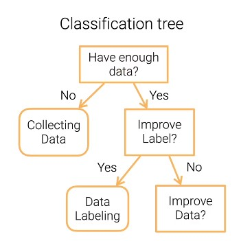
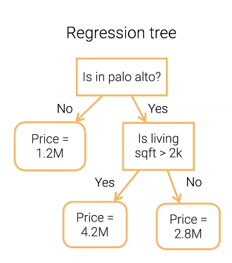

**决策树：用决策树来做决定** 

### 例子

- 怎么用决策树来做分类：拿一个数据，看一下这个数据在节点上是应该往哪个方向走，一直往下走，走到叶子节点，就会得到数据所对应的标号
  - 
- 用决策树做回归：与上面那个例子不同的是，叶节点不是一个具体的类而是一个实数值 
  - 

### 决策树的好坏

- #### 好处

  - 可以解释（可以让人看到对数据处理的过程）
    - 常用于银行业保险业

  - 可以处理数值类和类别类的特征；

- #### 坏处

  - 不稳定（数据产生一定的噪音之后，整棵树构建出的样子可能会不一样）
    - 解决方法：使用集成学习 (ensemble learning)

  - 数据过于复杂会生成过于复杂的树，会导致过拟合
    - 解决办法：把决策树的枝剪掉一些
      - 在训练时觉得太复杂了就停下来，或在训练之后把特往下的节点给剪掉

  - 大量的判断语句（太顺序化）不太好并行
    - 在性能上会吃亏

  ### 提升树模型的方法

  - #### 随机森林（稳定决策树）

    - 训练多个决策树来提升稳定性：
      - 每棵树会独立的进行训练，训练之后这些树一起作用得出结果
      - 分类的话，可以用投票（少数服从多数）
      - 回归的话，实数值可以是每棵树的结果求平均
    - 随机来自以下两种情况：
      - Bagging：在训练集中随机采样一些样本出来（放回，可重复）
      - 在bagging出来的数字中，再随机采样一些特征列出来，不用整个特征（不会把两颗完全一样的列放进来）

  - #### Boosting

    - 基于梯度的boosting
      - 顺序完成多个树的训练（之前是独立的完成）
      - 利用训练好的树与真实值做残差来训练新的树，训练好了之后再与之前的树相加
      - 残差 等价于： 取了一个平均均方误差（预测值与真实值的）再求梯度再取个负号

### 总结

- 树模型不是很稳定，对数据的噪音非常敏感

- 树模型在工业界用的比较多

  - 简单，训练算法简单，没有太多的超参数，结果还不错（不用调参，结果还不错）

  - 树模型能够用的时候，通常是第一选择