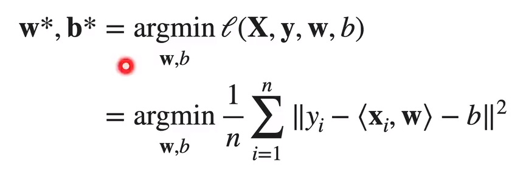

### 线性回归介绍

- 以之前房价预测的例子：

  - 三个特征：x1= #bed ，x2 = #baths ， x3 = living sqft

  - 预测房价为y = w1x1 + w2x2 + w3x3 + b 

  - 在模型中的参数w（权重）与b（偏差）是可以通过数据学习的 

- 通常情况下 给定数据 X = [x1, x2, ..., xp]

- 线性回归预测y = w1x1 + w2x2 + ... + wpxp + b = <**w,x**> + b

- w =  [w1, w2，...， wp] 和 b 都是可训练参数

- 代码实现

  ```python
  # weight w has shape (p, 1)
  # bias b is a scalar
  # data x has shape (p, 1)
  y_hat = (x * w).sum() + b
  ```

### 目标函数

-  假设收集了n个训练样本$X = [x_1, x_2, ...,x_n]^T∈R^{n×p} ，标号y = [y_1,y_2,...,y_n]^T ∈R^n$

- 优化 平均均方误差 （MSE） 

  - 

    - L 目标函数 

    - w* b* 最小化的目标权重和偏置
    - yi是真实房价，<**w,x**> + b 是预测值

### 线性模型做分类

- 回归的输出是一段连续的实数，分类是输出对样本类别的预测；

- 在这个部分，我们所关心的是多类的分类问题

  - 可以使用向量来输出（不是输出1个元素而是m个元素 m为类别数）；
  - 使用线性模型预测出样本数据类别的置信度，
    - 最大置信度的类别为样本数据所对应的类别并用onehot（独热）编码输出。
  - 这里的目标函数是MSE（均方误差） 

- 使用MSE做为目标函数的分类存在问题

  - 使用均方误差（MSE）作为目标函数，使得预测值趋近真实值，但是作为分类关心的是数据对应类别的置信度

  - 解决方法：

    - 让模型更加专注到把正确的类别弄出来（softmax回归）

      - 把预测的分数换成概率的形式（Softmax函数）

        - $\widehat y = softmax(o) ,其中\widehat{y_i} = \frac {exp(o_i)}{\sum^m_{k=1}exp(o_k)}$
        - 代码实现

        ```python
        0_exp = torch.exp(0)
        partition = 0_exp.sum(1, keepdim = True)
        Y = 0_exp / partition
        ```

        

    - 衡量真实值概率与预测值概率的区别，用Cross-entropy(交叉熵) 
      - $H(y,\widehat y) = \sum_i-y_ilog(\widehat {y_i}) = -log\widehat y _y$
      - 更加关注在正确类别上预测概率有多高
      - 对于别的类别关心的较少，在损失里不去考虑每一个是什么

