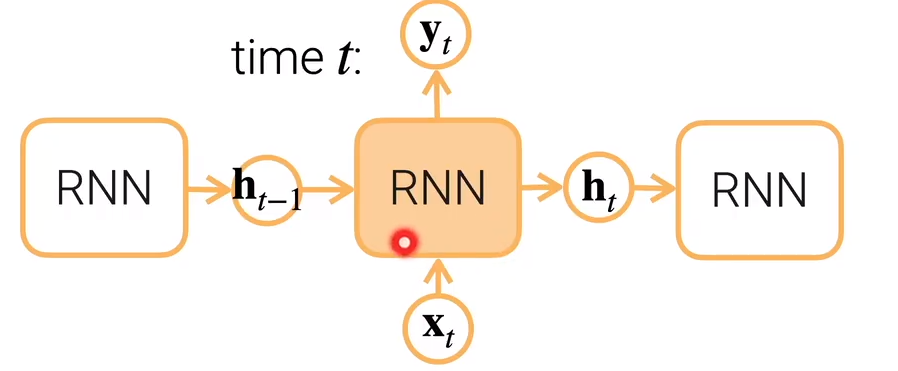

### 从多层感知机过渡到训练神经网络


- NLP（自然语言处理）中的经典应用
  - 语言模型（每次给一些词或者是句子里前面那些字然后去预测下一个字是什么）;

- 用MLP来做： 	

  - 每一次就使用一个最简单的全连接层做一个softmax回归，然后做分类
    - 输出：有多少个词做多少个分类

  - 做第一个（用hello预测world）预测还好，但是在下一个词时只看到了上一个时刻的词没有看到之前时刻的词（只看到world这个词没有看到hello）

  - 如果我们在world之前可以加上hello这个词，但是长度会发生变化（全连接的输入项是不能发生变化的，如果是在one-hot里加上去的话，则表现不出时序性） 


- 用RNN来做：

  - 前部分是跟之前的是一样的，但要怎么把上一个时刻的信息弄出来呢？上一个全连接层的输出还没有进入softmax，这里面可能包含了hello的信息，将这个值复制一遍，让它跟world这个词的向量表示放在一起(concat)，进而可以预测出！；

  - 上面包含hello的信息的值H叫隐藏状态(Hidden status)，之所以叫这个名字，是因为它的信息可以往后走，不管它走多少步H的大小是不发生变换的（取决于上一个全连接层输出的个数）；

  - 如果H一直这样走下去的话，它就包含这以前所有它看过的信息

- #### 用RNN具体如何做

  - 最简单的RNN：$h_t = \phi(W_{hh}h_{t-1} + W_{hx}x_t + b_h) $
    - ![输入图片描述]
    - **$h_t$作为隐藏状态放到下一个时刻**
    - **上一个时刻的$h_{t-1}$的一个输出作为隐藏状态放进当前时间t的RNN** 
    - **上一个它的输出作为这一刻的输入 并进来 再加上激活函数**
  - $y_t$与$h_t$本质上一个东西
    - 在简单的RNN模型里面是这样的，在复杂的版本就可能不是了
  - 与MLP不同的地方在于加多了一项，这一项为上一个时刻的输出作为这一个时刻的输入再乘上个可学习参数Whh

- #### 现在常用的RNN层：

  - 相对来说复杂一点，带有门的RNN如  **LSTM和GRU** 
    - 它们会在里面会做一些很细微的控制（信息流是怎么流的）
    - 忘掉输入：在算 $y_t$ 的时候，想要抑制掉$x_t$
      - 可能$x_t$对 结果的表示 没有那么重要 介词、符号之类的
      - 用 可以学习权重权重 来控制这个输入是否需要抑制
    - 忘掉过去关注现在：新的句子（段落）开始、过去的信息很久很久的信息跟现在没有太大的关系了
      - 也用 可以学习权重 来控制这个输入是否需要抑制 

- #### simple RNN的实现

  - ```python
    W_xh = nn.Parameter(torch.randn(num_inputs, num_hiddens)*0.01)
    W_hh = nn.Parameter(torch.randn(num_hiddens, num_inputs)*0.01)
    b_h = nn.Parameter(torch.zeros(num_hiddens))
    
    H = torch.zeros(num_hiddens)
    outputs = []
    for X in inputs :#'input' shape:(num_steps, batch_size, num_inputs)
        H = torch.tanh(X @ W_xh + H @ W_hh + b_h)
        outputs.append(H)
    ```

- #### 拓展RNN

  - 
  - 一个方向-->两个方向：双向RNN(适用于  得到了整个序列，求中间的缺失序列  如完形填空)
    - 正向层：将过去时刻的信息放入当前时刻 
    - 反向层：时刻t+1的信息往时刻t的方向走
    - 这里的时刻我觉得不是时间的概念要看成是文本中的词序可能会好理解一点
    - 最后结合正向层和反向层的信息相结合作为$y_t$
  - 把不同的层跟MLP一样累加起来，做成多层RNN 

- 对模型的选择

  - 
  - 对表格数据：可以使用树模型、线性模型或者是MLP
  - 对于文本（有时序信息）：可以使用RNN
  - 对于图片、音频、视频（有相似的空间信息）：可以用CNN
  - Transformers这个模型又能处理有时序信息的东西，又能处理有空间信息的东西

### 总结

- MLP（多层感知机）：就是将多个全连接层堆起来，然后通过激活层来得到非线性的模型
- CNN（卷积神经网络）：可以看作是比较特殊的全连接层，其中的卷积层使用了空间上的本地性和平移不变性然后做了一个简化版的全连接层，参数少，更适合处理空间信息；将卷积层和汇聚层（池化层）堆叠起来可以得到一种高效抓取空间信息的模型
- RNN（循环神经网络）：可以看作是全连接层在时序上用了过去的信息，放在了现在，在全连接层加了一条额外的边，得到一个循环神经网络，能够作用于有时序信息的数据 
