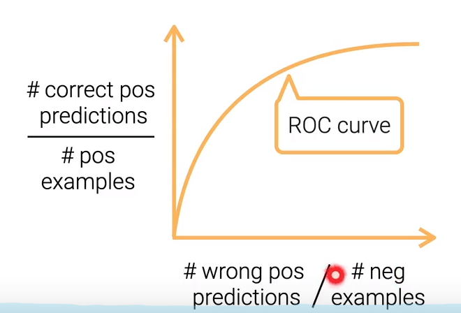
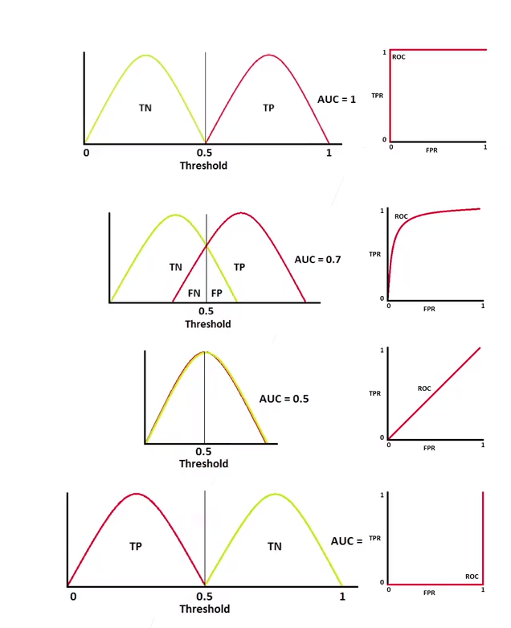

- 机器学习就是我们对一些事物（房价预测）感兴趣要对其建模，我们可将这个事物定义为P（概率分布）；
- 第一章与第二章是说怎么从P中采样数据（data）；
- 第三章是介绍各种机器学习的算法，以及怎么对它进行训练；
- 对于机器学习来讲，我们更关心是在新数据中模型对其的预测情况是否正确（对新数据是否有泛化能力）；
- 本节课讲的是，对于一个算法如果只是在这个数据中训练的比较好的话，不代表在新的数据上效果比较好，所以将会介绍怎么样去衡量它，衡量模型的好坏
- 本节课是 给定了数据与超参数并且已经训练好了模型，然后再来判断模型的好坏（与超参数、数据相关）

## 模型指标

- ### 在监督学习中

  - 我们常会使用最小化损失函数来训练模型，所以损失(loss value)是用来衡量模型质量的指标；
  - 模型的质量要由多个指标来衡量 
    - 如分类时的 模型精度
    - 目标检测时的 mAP
    - 部署到产品时的商业指标（模型对营收的增长、模型反馈的效率（inference latency））
  - 通常会通过模型指标对模型进行选择（通过多个指标）

- ### 例：广告展示

  1. 输入一些搜索词（在看的具体网页） ==>
  2.  取出相关的网页 ==> 
  3. 预测用户点击广告的点击率（点击率高的给用户看）==> 
     - 因为不知道点击率会是多少，所以弄成一个机器学习的问题，用机器学习来判断用户的点击（二分类问题）
  4. 把所有的广告通过CTR(点击率)乘上广告主给的钱来排序 

### 常见关于分类的指标

- 准确率（Accuracy）：在样本中预测正确的比例是多少
  - `sum(y == y_hat) / y.size`
  - 衡量分类问题最常见的作法，但是我们不关心对负类（我们不需要的类型）的准确率
- 精度（Precision）：对具体类  i   看预测正确了为类  i 的有多少个 比上 预测的结果为类 i 的总数量
  - 把多少个样本 预测成了类 i 并且它真的是类 i  占 所有预测为类i  的比例
  - `sum((y_hat == 1) & (y ==1)) / sum(y_hat == 1)`
- 召回率（Recall）：对预测正确的类 i 个数 占 样本中类 i 的数量 的比例
  - `sum((y_hat == 1) & (y ==1)) / sum(y == 1)`
- F1：作为精度(p)与召回(r)的权衡
  -  `2pr / (p + r)`

### AUC 与 ROC  （通常用于广告）

- **我们需要的是在这个模型中是否能够将两个类区分开**
- 定义一个阈值θ，当预测精度大于θ时是正类，反之为负类；
  - 一般来说θ会取0.5（正负样本比较平衡的时候可以取）
  - 在实际的生产中我们会根据需求去选择 θ
- 如何调整θ：
  - ROC曲线（曲线与x轴的面积是AUC）：
    - 
    - x轴是 预测成正类但是是负类的数量 比上 负类的总数；
    - y轴是 预测为正类实际上也是正类的数量 比上 正类的样本数；
    - 每次选一个不同的θ值，ROC曲线也会不一样
    - 对图线的解读 
      - 
        - 当AUC = 1， 表示模型能够完美的区分两个类
        - 当AUC = 0.7时， 表示中间有一块不好区分
        - 当AUC = 0.5时，表示基本上糅合在一起，没有区分能力，是一个随机的预测
        - 当AUC = 0 时，表示预测反了，把整个模型符号一换 就可以进行正确的预测
        - **当AUC>0.5时，表示本身预测结果，AUC<0.5 就变成 1-0.5的预测结果 ，AUC = 0.5 表示预测结果很糟糕**

### 在广告展示中的商业指标 

- **任务是优化收入和用户的体验**

  - 延迟（Latency）：当模型部署到线上，会要求模型在100毫秒内去展示数据给用户  （整体在300-500ms以内）
  - ASN：平均每一页展示的广告数
  - CTR：真实用户的点击率
  - ACP：平均一次点击广告主会给多少钱
  - 收入：页面的流量 * ASN * CTR * ACP
    - 平台方关心总收入和流量
    - 用户与  ASN与CTR  有关

    - 广告主关心  CTR与ACP 

- #### 商业指标的权衡

  - 对于模型来说，我们关心模型的AUC；但是只看AUC可能会有问题
  - 一个新的模型其AUC增加了，但是很有可能会发现商业的一些指标下降了，AUC只是反映了一个统计值，预测的CTR可能发生变换，但在统计上没有发生变化，可是它还是会影响实际我们的收入
    - 预测的CTR值变低了，但是AUC的数值没有改变，可是会引起预测用户点击的置信值降低了，可能会导致展示的广告数目降低
    - 可能新换的广告实际的CTR低，模型使用的是过去的数据，市场是会变化的，用户可能不喜欢基于过去数据的广告
    - 可能模型挑选的广告，广告主出的价格比较低
  - 权衡模型指标与商业指标
    - 最好的办法：将模型部署到线上，用实际的数据来观察实际的商业指标。 

## 总结

- 对一个模型来说，我们通常回去考虑多个指标；
- 比如，做分类的话可使用精度、准确度、召回率、F1、AUC；
- 上面的指标也只是在机器学习的课程论文上看到的，但是实际上商业上也有一套指标来评估这个模型怎样影响产品；
- 好的模型要通过商业的验证才能上线。