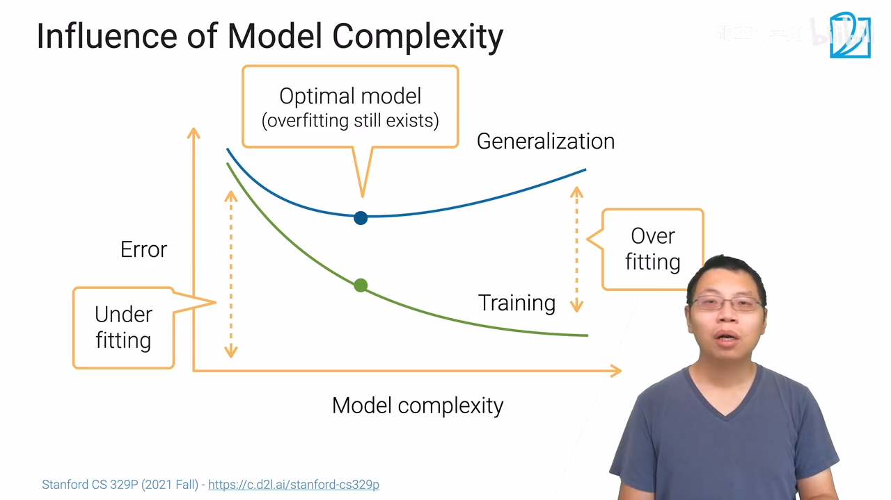
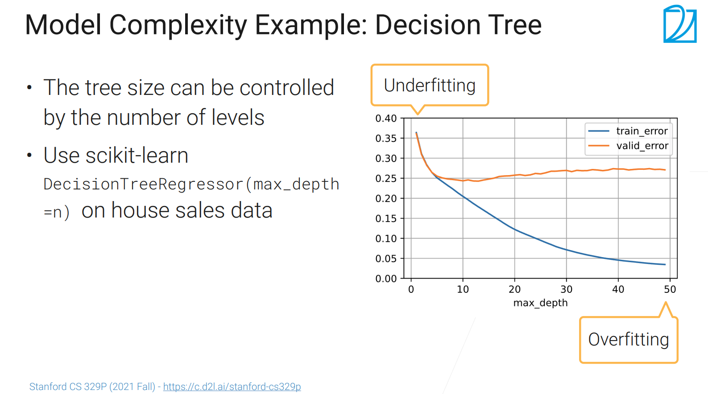
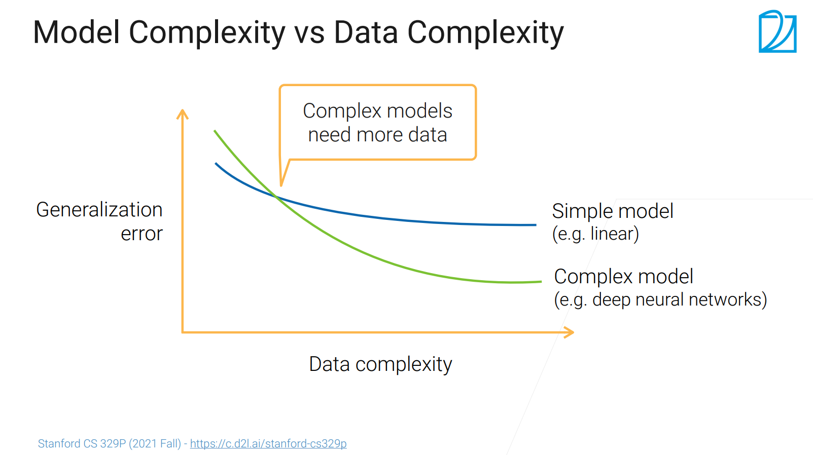

虽然模型会有很好的精度，但是在实际情况中可能会有很大的问题（在数据上取得比较好的成绩与在实际应用中做的好不好，中间是有比较大的代沟的）

## 训练与泛化误差

- ### 概念

  - **训练误差**：模型在训练数据上看到的错误率

  - **泛化误差**：模型在新的（没见过）数据上的训练结果的误差

  - 例子：

    - 用过去考试的试题来预测未来的考试
    - 在过去考试的训练误差（在历年真题上的成绩）不一定能保证你能在未来考试能取得一个理想的成绩
    - 学生A在历年真题上取得了不错的成绩（把所有参考书中的答案记下来了），可能在模拟考试中成绩不错，但是在真正考试的时候效果可能没那么好
    - 学生B没有记住题目但是他理解了解题思路，虽然在历年真题上的成绩没有A这么好但是在新的考试上成绩可能也跟A差不多（或者好）

- ### 训练与泛化误差区别

  - **训练误差与泛化误差都很低**：这是我们想要的情况
  - **训练误差很高但泛化误差很低**：这是一个很有意思的现象，可能是由bug；如果没有bug，有可能是训练的样本过难了
    - 训练做了小学三年级的题目结果考试是小学一年级的题目
    - 在训练时用了大量的数据增强或在样本中加入大量的噪音的话，训练的时候误差可能会高一点，但是测试时数据相对比较干净，可能泛化误差会好一些但也不会好太多
  - **泛化误差很高但训练误差很低**：训练的时候做的很好但是拿到新数据就不行了，这种现象叫**过拟合**（overfitting），过多的去看了训练数据，而没有去理解后面到底发生了什么事
  - **训练误差很高且泛化误差很高**：表示模型没有理解数据没有抓住数据中的信息，这种现象叫**欠拟合**（Underfitting）

- ### 什么情况会导致欠拟合和过拟合

  - 考虑数据的复杂性（数据有多复杂）和模型的复杂性（模型有多强大），因为是用模型去拟合数据，所以它们之间的关系会比较对等
    - 数据相对简单，应该选取相对简单的模型，就可以得到一个正常的现象
    - 数据比较简单，但选取了复杂的模型，可能会导致过拟合(overfitting)
    - 数据比较复杂，但选取了简单的模型，则模型无法拟合数据，就会导致欠拟合(Underfitting)
    - 数据比较复杂，选取了复杂的模型，会得到一个正常的现象

- ### 模型的复杂度（能够拟合各种各样函数的能力） 

  - 低复杂度的模型，比较难去拟合训练的数据

  - 高复杂度的模型，能够拟合更多函数，甚至可以把整个训练样本给记住了

  - 其实我们是不好去比较不同算法的模型复杂度的（树与神经网络的对比）

    - 如果两个模型本质上是一个东西（都是树 或都是神经网络）
      - 一个模型可以学习的参数要比另一个多的话，多参数的模型相对来说要复杂一些；
      - 可学习参数里面可以取多少值（取±1或任意值），有值限制的模型相对会简单一些（即正则化） 

  - #### 模型的复杂度产生的影响

    - 模型的复杂度比较小时，训练误差与泛化误差会比较高（这时叫做欠拟合）；
    - 随着模型复杂度的增加，模型的拟合能力会变得越来越强，会导致训练误差会降低，但是泛化误差不会一直降低，其过了过特定点之后会逐渐升高（泛化误差与训练误差差距较大，过拟合）
      - 记住了太多的细节，这些过多没用的细节导致在新的样本上效果比较差
    - 最好的地方是泛化误差最低的点，但是就算是最好的情况，可能还是会有overfitting
      - 

  - #### 例子: 选择最大深度是10的模型可能是最好的 

    - 

- ### 数据的复杂度

  - 数据复杂度与以下因素有关
    - 样本的数量（样本数越多，数据就越复杂一点）
    - 每个样本有多少个元素
    - 数据中是否有时间或空间的结构（股票有时间的结构，图片是有空间结构的）
    - 多样性（多样性更大，样本就更复杂一点）
  - 当然也是很难比较两个数据集的复杂程度
    - 图片数据集与文本数据集（像素与字符比较）
    - 但是可以比较类似数据的复杂程度；不一样的话很多时候要靠直觉。

- ### 当数据复杂度与模型复杂度都在变化时 

  - 
  - 给定一个模型，不断增加数据的复杂度，模型会从overfitting慢慢的变成underfitting，但是会发现泛化误差在下降
    - 但是随着数据复杂度越高，泛化误差会逐渐平稳，因为模型无法再从这些数据中抽取有用的信息了，这时可以考虑一下换个相对复杂的模型（其泛化误差的下限会低一点）
  - 对于工业界来讲
    - 一开始数据复杂度比较小，应该先考虑简单的网络，这样会比较容易调参，而且可能效果会很好；
    - 但是随着样本数的变大（模型部署后不断的收集数据，对数据进行处理），逐渐就会发现之间训练的模型已经跟不上数据的进步了，这时候可能就要考虑从一个简单的模型升级到一个相对复杂的模型 
  - **数据的复杂度和模型的复杂度是要相互匹配的** 

- ### 模型的选择

  - 需要选择一个跟数据集有着合适复杂度的模型
    - 用于降低泛化误差，同样需要考虑商业指标
  - 可以先选择一个模型的类，然后再选择合适的超参数
    - （树：有多少棵树，树有多深
    - （神经网络：选择什么架构，有多少层，有多宽/隐藏层的大小，要不要加些正则项）

## 总结

- 我们关心的是**泛化误差**而不是训练误差（**在新的数据上模型的表现情况**）；
- 模型复杂度：模型能够去拟合各种各样函数的能力
- 数据复杂度：数据里面有多少信息，信息量越大，数据复杂度越大；
- 模型选择：需要去选择一个合适的模型去避免欠拟合和过拟合
  - 模型复杂度过高导致的过拟合(overfitting)
  - 模型复杂度过低导致的欠拟合（underfitting）】

