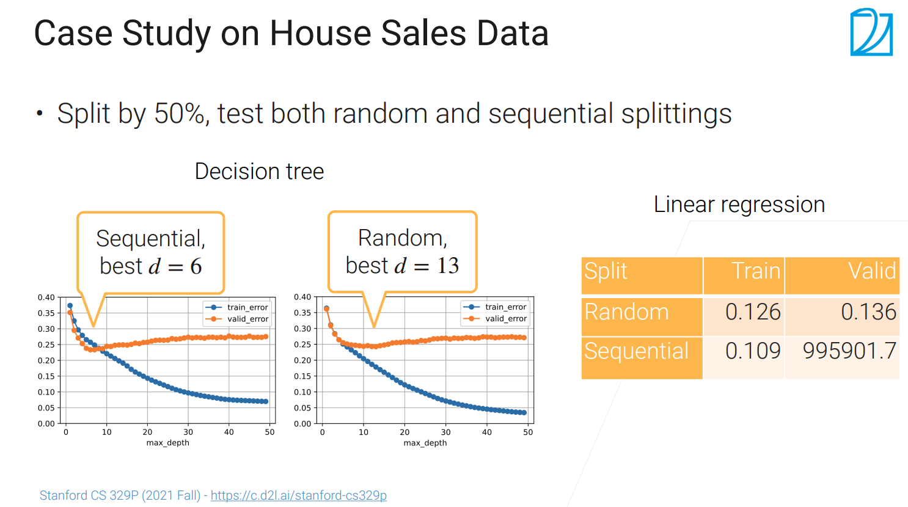
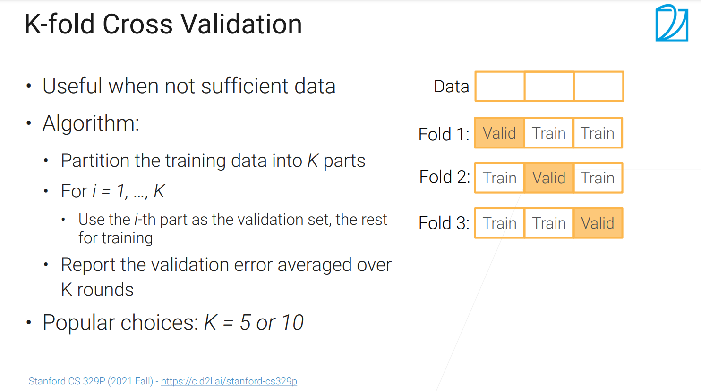

## 估计泛化误差

- 我们最关心的是模型的泛化误差
  - 在未知数据上模型的表现，在统计上要用很大的数据集，在实际中通常会用测试数据集（只能使用一次），在其上的误差近似泛化误差
    - 比如说，课程的期中考试的分数；
    - 本来是想预测房价的，但是如果在出了房价之后再进行预测则这样毫无意义；
    - Kaggle上的私榜（private leaderboard）
- 上面的操作虽然能很好的近似泛化误差，但是实际使用比较困难（数据只能使用一次）；
- 所有在实际应用中，我们会使用验证集（Validation dataset），可以被使用多次，来看模型的质量从而进行模型的选择。
  - 验证集是训练数据集中的一块
  - 当我们使用“测试"这个词是，通常指的是验证（在论文中说的测试数据集通常说的就是验证数据集）

## 常见生成验证数据集的方法

- 将训练样本分成两个集合，一个是训练集，一个是验证集，在训练集上训练模型，在验证集上计算误差（或其他指标），用验证集算到的误差来近似泛化误差
- 一般来说会选取 n% 的样本作为验证集（可以取50，40，30，20，10； 取决于样本足不足够，样本数多可以选择50%作为验证集，样本不够多的话，可以选择20%作为验证集） 

## 样本不具有随机性时

- 有很多时候随机不一定行
  - 随机行的时候是假设数据、每个样本之间是符合独立同分布的
    - 样本之间是没有关系的，是随机生成的
  - 因为在实际生活中很多数据不是一个随机的（不符合I.I.D.）假设。
- 数据中有些时序的信息，如卖房的价格、股票价格
  - 如果选验证集是随机的话，验证和训练时可能时看同一天的数据，这时可能会有误差
  - 这时需要保证，验证集要在训练集之后；
- 样本属于不同的组（groups），同一个人的图片集
  - 如果选验证集是随机的话，同一个人的照片可能会出现在训练与验证集中，这样精度可能会低很多（重复的样本出现在测试集中）
  - 这时可以 在不同组之间进行分割（不同的人来分验证集）
- 样本不是平衡的（有些类很多，有些类很少）
  - 如果选验证集是随机的话，类多的样本采样了比较多，类少的采样比较少，精度可能会偏高（少类的部分没有怎么学习到）；
  - 这时可以 在取验证集时对类少的数据采样的概率高一些（或做成平衡的数据集）

## 具体的例子（预测房价）

- 随机的选择50%的样本做验证集；决策树：深度为 13 的时候测试误差往上走了（相当于我可以看清楚全局发生的事情，并进行预测，不会过拟合于一些局部的信息）；线性回归：训练和验证误差都很正常；
- 前一半时间训练，后一半时间做验证；决策树：深度为 6 的时候测试误差往上走了（未来的房价可能会发生很大的变化，所以过拟合提前了）；线性回归：在训练时很好，但在验证时就不太行了
- 房价那个怎么切应该看具体需求
  - 情况一：你想通过模型求已有数据的时间范围内的数据（比如你有除了周四以外一周的数据，你想求周四的具体数值），你可以运用随机选的方式来训练模型，一般来讲，通过模型训练的方式得到结果的误差比样条插值小。
  - 情况二：你想用训练出的模型去预测数据范围内以外的数据，（比如你有一周的数据，你想求下一周的情况如何），一般来讲运用顺序选的方式能更好反映出模型的真实水平（这种方法在验证数据上效果相比另外一种差，但更真实）。原因是因为和时间序列有关的数据，时间紧挨着的数据项之间存在高度的相关性，即使你是通过随机选取的方法并没有选取到时刻为a的数据，但如果你选取了a-1或者a+1时刻的数据，就会一定程度上导致时刻为a的数据的泄露。从而导致验证数据集的准确度虚高。
  - 总之，验证数据集不能被泄露，对于相对独立类型的数据，只要保证验证数据集和训练数据集分开就好了，但是对于具有时间序列信息的数据，单纯将训练数据集和验证数据集分开仍然会造成泄露，因为训练数据会透露训练数据之间的验证数据的信息。

## K折交叉验证法（数据没有那么多）

- 把一个训练集切成k块，在这k块中取出一个作为验证集中的样本，剩下的用于训练；
- 将这k个验证误差平均起来作为验证误差
  - 一般可以取k=5  (80%作为训练 ，20%作为验证)或者10 （90%作为训练，10%作为验证）

## 常见的错误

- 在机器学习中结果非常好90%都是bug造成的
  - 很有可能是验证集被污染了（与训练集有重叠）
- 例
  - 验证集中有来自于训练集的样本
    - 代码可能没有问题，原始样本可能是重复的，这个重复的样本可能会分到训练集和验证集
  - 在数据融合时经常会发生
    - 假设要去评估在imageNet上训练模型的好坏时，所有的调优都是用imageNet的，但自己用了imageNet的标签找了新的样本作为验证集，可能我们找的图片跟imageNet中的图片可能会有重叠（记得去冗余）
- 信息泄露：通常发生于非随机性（I.I.D.）的数据，如 在做房价预测或股票预测时，训练时看到了未来的数据了（即验证集的数据）

## 总结

- 评估模型的泛化误差的时候通过会使用测试误差来近似泛化误差；
  - 因为测试数据只能用一次，这样太费数据了；实际上我们使用的是验证集
- 验证集通常是从训练集中出来的
  - 在验证集上，可以对模型进行多次评估来进行模型的选择
  - 验证集需要跟真实的测试数据（部署后接收的数据）要尽量相似
    - 特别是，对于非随机性的数据时，要预测未来时，也要保证训练集和验证集要在具有过去未来的关系
  - 如果验证集选取的不好的话（信息泄露），这样可能会过高的评估模型的好坏