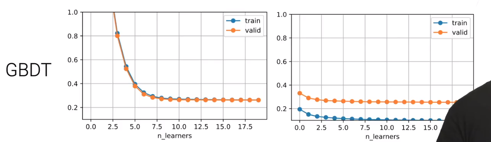

## Boosting 

- boosting 是说将多个弱一点的模型（偏差比较大）组合起来变成强一点的模型（偏差比较小），
  - 主要是为了去降低偏差而不是方差【Bagging 把多个不那么稳定的模型把它们放在一起得到一个相对稳定的模型】

- Boosting是要按顺序的学习【bagging是每个模型是独立的】
- 具体的做法：
  - 每一次在第i步的时候，会训练一个弱模型$h_i$，
  - 然后去评估一下它的误差$ε_t$；
  - 然后根据当前的误差$ε_t$重新采样一下，使得接下来的模型$h_i+1$会去关注那些预测不正确的样本；


## Gradient boosting

- 假设在时间 t 时训练好的模型时$H_t(x)$，$H_1(x)=0$

- 时间1时

  - 在残差上训练新的模型ht
    - 残差指在m个样本中样本本身 特征不发生变化，标号变为实际标号减去预测的标号（拟合不够的差值）
    - 时间1时 是在原始的样本上进行训练，但是在之后的时间内，都是把当前时刻boosting的模型去拟合 拟合不够的那个差值
  - 然后将$h_t$ * η（学习率）加进当前整个boosting出来的模型，变成下一个时刻boosting出来的模型
    - $H_{t+1}(x) = H_t(x) +  ηh_t(x)$
      - 【η是作为一个正则项，boosting中叫收缩】（当然η可以为1，但是这样很容易过拟合）
  
- 残差实际上等价于 MSE作为损失函数($\delta L/\delta H$)时 损失函数L对函数H做负梯度

- 为什么会叫gradient boosting？是因为其他的boosting 函数可以换到gradient boosting的框架里面（取决于要怎么去选损失函数L）

- **代码实现**

  ```python
  class GradientBoosting:
  	def __init__(self, base_learnier, n_learners, learning_rate):
  		self.learner = [clone(base_learner) for _ in range(n_learners)]
          self.lr = learning_rate
  		
  	def fit(self, X, y):
          residual = y.copy()   # 为了不影响y的原始数据
  		for learner in self.learners:
  			learner.fit(X, residual)
               residual -= self.lr*learner.predict(X)
  			
  	def predict(self, X):
  		preds = [learner.predict(X) for learner in self.learner]
  		return np.array(preds).sum(axis = 0)*self.lr  
  ```

## gradient boosting的效果

- 用决策树作为weak learner（Gradient boosting 很容易 过拟合，所以我们需要对它做些正则化，需要用一个弱的模型来做）
  - 但是决策树是一个强模型，我们需要限制树的最高层数，也可以随机采样一些特征（列）
  
- 在GBDT（决策树gradient boosting）中模型没有过拟合（每一个小模型确实比较弱，学习率也定的比较低），

- 当weak learner、学习率 控制得比较好的时候，它的过拟合现象没那么严重

  

- GBDT需要顺序训练，在大的训练集上会比较吃亏，所以会用一些加速算法如：XGBoost，lightGBM

## 总结

- Boosting是说把n个弱一点的模型组合在一起变成一个比较强的模型，用于降低偏差
- Gradient boosting 是boosting的一种，每一次弱的模型是去拟合 在标号上的残差，可以认为是每次去拟合给定损失函数的负梯度方向 