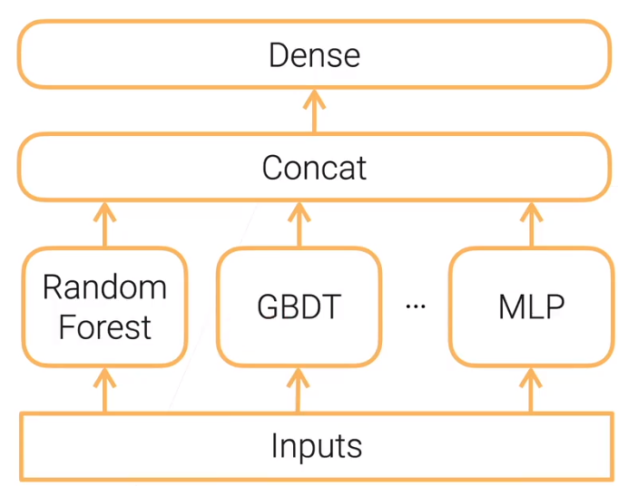
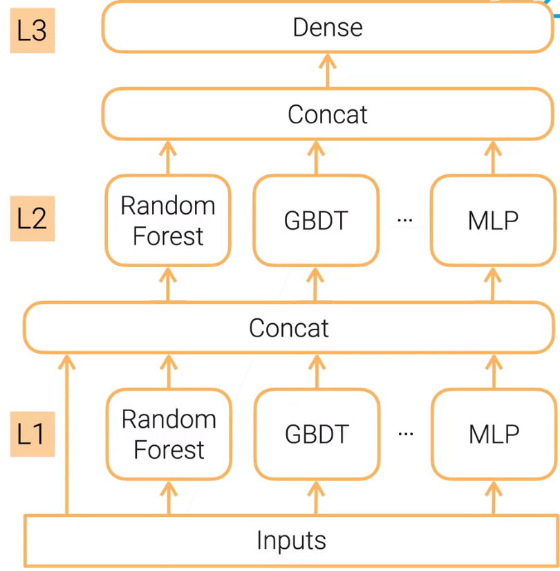

##  Stacking

- stacking 跟之前个begging有一点像的，都是将多个base learner放在一起，来降低方差；
- 但是不同在于
  - stacking的base learner可以有不同的模型类别；
  - stacking的输出是concat起来的（模型种类不一样输出可能不同），然后再做线性的组合就得到最终的输出
  - 【begging是在不同数据上多次训练同样的模型；begging是在同一数据上对所有模型的输出做平均或做投票】；
- 
- 每个模型是在原始数据上训练不需要再通过bootstrap 的采样（如果base learner是随机森林的话是已经做了的）
- 竞赛中经常被使用，一般是每一个人训练不一样的模型，甚至是做不一样的特征提取，最后再将结果加起来

## stacking的效果

- 直接使用的是AutoGluon的实现

  ```python
  from autogluon.tabular import TabularPredictor
  predictor  = TabularPredictor(label = label).fit(train, num_stack_level = 0, num_bag_folds = 5)
  #num_stack_level = 0 为做一层的stack，num_bag_folds = 5  5倍交叉验证
  ```

  

- 做stacking的时候没有办法保证每一个模型的效果都很好，很多时候需要加入能够提升模型精度的模型 

## 多层stacking（降低偏差 )

- 将第一层stacking的输出看成是特征送入下一层的stacking中
  - （第二层的输入是基于上一层的输出，离最后的标号很近了，所以下一层训练起来会比较容易），这样可以把没有训练好的地方重新训练；
- 在这里也可以将原始的特征直接与第一层的输出一起送入下一层
- 多层stacking很容易过拟合（同一份数据又送进去学了一遍）

## 减轻多层stacking的过拟合

- 最简单的一种做法就是每一层的数据不是同一份数据
  - 将数据集分成两块A、B（2层stacking），然后用A训练第一层模型L1，用L1对B进行预测，把预测的结果加上B本身训练第二层模型L2
- 每一次只用了一半的数据比较亏，所以使用重复k折bagging的方法，
  - 像k折交叉验证一样，将数据集分成k份，每一次在k-1份上训练，再用第k份做验证，这样可以训练k个模型
  - 每个模型用这个方法训练了一次 所以每次训练了是k*n个小模型
- 更加昂贵的做法，对上述的做法重复做n次k折交叉验证，这样可以拿到n个预测值，再取平均放入下一层中

使用多层stacking的效果 

## Stacking总结

- stacking就是把多个不同的模型合并起来，用来降低方差，获取多样性；
- 多层stacking能够把多层的模型合并起来，每一层在下一层的基础上，再更好的拟合数据，来降低偏差，
  - 但是这样的模型很容易过拟合，需要做大量的工作避免其过拟合
    - （重复的k折bagging，每一层都能在完整的数据集上训练；重复k折使得训练的数据都不会更上一层的数据混在一起）

- stacking经常在竞赛中被使用，但问题很明显，它需要把多个模型放在一起，相对来说比较贵；关注精度和结果的可以使用它；
- 如果觉得模型太贵了，线上表现太差可以使用蒸馏（可以使得模型变小，但是也尽量保护住了精度）

## 最后的总结

| Reduce                     | Bias偏差 | Variance方差 | ComputationCost计算量 | Parallelization |
| -------------------------- | -------- | ------------ | --------------------- | --------------- |
| Bagging                    |          | Y            | n                     | n               |
| Boosting                   | Y        |              | n                     | 1               |
| Stacking                   |          | Y            | n                     | n               |
| K-fold muti-level Stacking | Y        | Y            | nlk                   | nk              |

- n ：learners的数量，l：层的数量，k：k-fold的数量

- 集成学习就是将多个模型组合起来来降低偏差和方差
- bagging是n个同样的模型做平均，主要目的是降低方差；
- boosting就是几个模型组合起来，主要是降低偏差
- stacking就是将多个不同的模型组合起来，降低方差
- 多层stacking，就是用来降低方差；
- 如果模型有n个的话，bagging,boosting,stacking的计算花销为之前的n倍；
- bagging与stacking的好处在于每个模型基本上可以独立参与训练，所以它们是可以做并行的；boosting是训练好一个模型后再训练一个模型
- 最后k折多层stacking基本上可以讲上面的好处都可以拿到，但是代价也非常明显，假设有 l层 n个模型 做 k折交叉验证 则计算花销是 n*l*k ，如果还要重复多次可以还要翻几倍
- 虽然k折多层staking每一层是顺序的关系，但是一层的里面是并行的